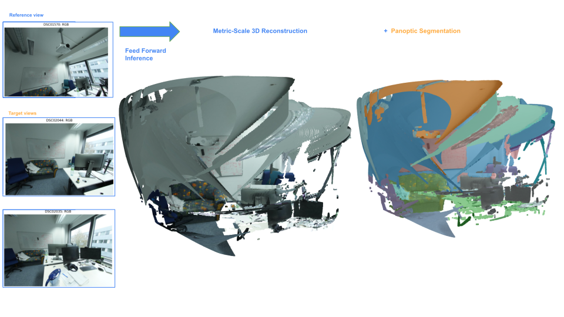
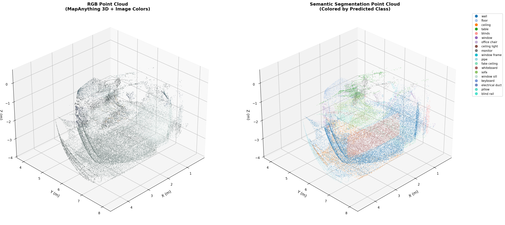
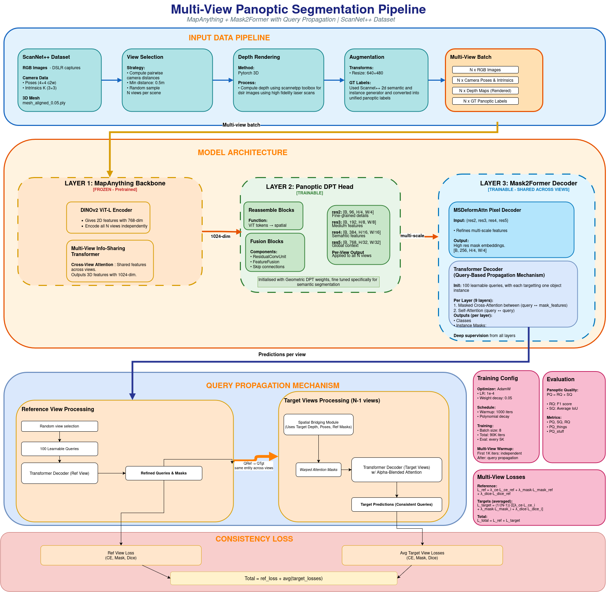
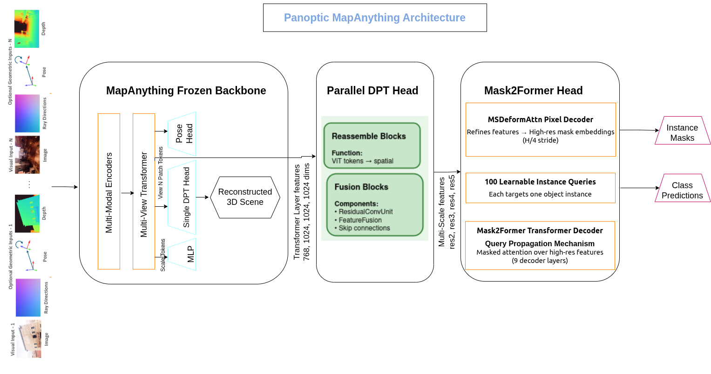
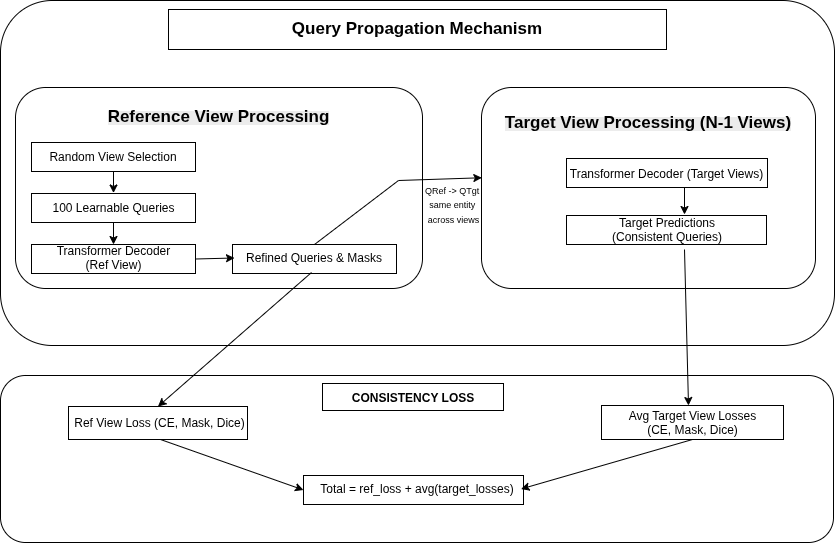

# Panoptic MapAnything

  

Current 3D panoptic scene segmentation approaches rely on specific inputs such as point clouds, posed rgb images and they demand costly test time optimization for 2D-3D alignment[1]. These models often have seperate segmentation and reconstruction pipelines with additional post processing steps which results in additional overhead with efficiency losses. Our approach mitigates these deficits by effectively utilising a 3D reconstruction backbone model such as MapAnything[2] with a customised Mask2former[3] head for multi view panoptic segmentation thereby creating a unified metric accurate feature rich semantic 3D map. We are using the ScanNet++[4] dataset which is a large scale benchmark dataset. It provides sub-millimeter resolution laser scans with RGB-D streams for developing richer 3D panoptic segmentation and Novel view synthesis models. We believe that our approach would show that the multiview features from the mapanything backbone can be effectively used by mask2former to provide a multi view consistent panoptic segmentation. **This can serve as a feature-rich, metric accurate semantic maps for indoor robot navigation while eliminating the need for posed inputs and costly test-time optimization**.

## Qualitative Results

  
  

## Key Highlights

* **Unified Architecture**: Utilizes a frozen MapAnything backbone combined with a trainable Panoptic DPT adapter and a Mask2Former head, merging metric 3D reconstruction with semantic segmentation.
* **Multi-View Consistency**: Features a custom Query Propagation mechanism that aligns object queries across reference and target views, ensuring that the same physical object receives consistent instance labels across multiple frames.
* **Feed-Forward Efficiency**: Directly processes collections of unposed RGB images to output metric-accurate semantic maps without relying on structure-from-motion preprocessing or heavy post-hoc fusion.
* **Benchmark Validation**: Evaluated on the large-scale ScanNet++ dataset, handling high-resolution indoor 3D scenes.

## Methodology

**Our approach involves a unified feed-forward pipeline broken down into the following stages:**

  

**1. Data Acquisition and Multiview Sampling**
* **Dataset**: We utilized the large-scale ScanNet++ Dataset[4]. 
* **Preprocessing Pipeline**: Panoptic annotations were generated through a custom two-stage pipeline. First, 3D mesh labels were projected to 2D images using z-buffering to determine visible mesh faces, yielding per-pixel semantic and instance IDs. Second, these raw labels were converted into the Detectron2 COCO panoptic format. 
* **Sampling**: Multi-view sampling was performed using maximum overlap sampling and a minimum camera threshold to ensure adequate visual overlap across reference and target views.

**2. Training Architecture**

  

* **Frozen MapAnything Backbone[2]**: Images are independently processed by a pretrained 768-dim DINOv2 ViT-L encoder. The output is passed to a multi-view info-sharing transformer that exchanges information across frames to generate robust 1024-dimensional multi-view aware features (N, B, C, H/14, W/14). This backbone remains frozen to preserve its learned geometric reasoning.
* **Trainable Panoptic DPT Head**: Initialised with weights from MapAnything's geometric DPT head to provide a strong spatial prior. It uses reassemble blocks, projection layers, resize layers, and fusion blocks to transform the single-resolution tokens into a multi-scale feature pyramid (res2 → res5) at strides 4, 8, 16, and 32.
* **Custom Multi-View Mask2former[3]**: 
  * *Pixel Decoder*: Utilizes a 6-layer MSDeformAttn module to refine the multi-scale features into high-resolution mask embeddings.
  * *Transformer Decoder & Query Propagation*: Initializes 100 learnable object queries. We enforce multi-view consistency through a **Query Propagation Mechanism**, where target views accept the reference view's refined query embeddings. This ensures that a specific query (e.g., Query #5) tracks the exact same semantic entity across all overlapping frames.
 

  

**3. Loss Calculation**
The total loss formulation avoids costly test-time optimization. It is computed directly during the single forward pass as the sum of the Reference View Loss and the average of the Target View Losses.

**4. Evaluation**
The model's performance is measured using the standard COCO Panoptic Evaluator, extracting PQ (Panoptic Quality), SQ (Segmentation Quality), and RQ (Recognition Quality) metrics.

## Acknowledgement

This project was done as part of Uni Bonn Coursework, **Perception and Learning for Robotics Lab**. We would like to thank our supervisors, [Prof. Dr. Hermann Blum](mailto:blumh@uni-bonn.de) and [Sami Azirar, MSc](mailto:sazirar@uni-bonn.de), for providing valuable guidance and support during this project.

## Contributors

* **[Sai Mukkundan Ramamoorthy](mailto:sai.ramamoorthy@smail.inf.h-brs.de)** - Architecture changes, environment setup and code changes, poster generation, presentation and report. 
* **[Aaron Cuthinho](mailto:aaron.cuthinho@smail.inf.h-brs.de)** - Architecture suggestions, code suggestions and changes, report and presentation.

## Code

**Will be updated later at the end of April 26'**

## References

1. Lojze Zust, Yohann Cabon, Juliette Marrie, Leonid Antsfeld, Boris Chidlovskii, Jerome Revaud, and Gabriela Csurka. Panst3r: Multi-view consistent panoptic segmentation. In _Proceedings of the IEEE/CVF International Conference on Computer Vision (ICCV)_, pages 5856–5866. Naver Labs Europe, 2025.
2. Naveen Keetha, Norman Müller, Johannes Schönberger, Lorenzo Porzi, Yinda Zhang, Tobias Fischer, Arno Knapitsch, Daniel Zauss, Ethan Weber, Nuno Antunes, Jonathon Luiten, Marc Lopez-Antequera, Samuel Rota Bulò, Christian Richardt, Deva Ramanan, Sebastian Scherer, and Peter Kontschieder. Mapanything: Universal feed-forward metric 3d reconstruction. _arXiv preprint arXiv:2509.13414_, 2025.
3. Bowen Cheng, Ishan Misra, Alexander G. Schwing, Alexander Kirillov, and Rohit Girdhar. Masked-attention mask transformer for universal image segmentation. In _2022 IEEE/CVF Conference on Computer Vision and Pattern Recognition (CVPR)_, pages 1280–1289, 2022.
4. Chandan Yeshwanth, Yu-Cheng Liu, Matthias Nießner, and Angela Dai. Scannet++: A high-fidelity dataset of 3d indoor scenes. In _Proceedings of the International Conference on Computer Vision (ICCV)_, 2023.
